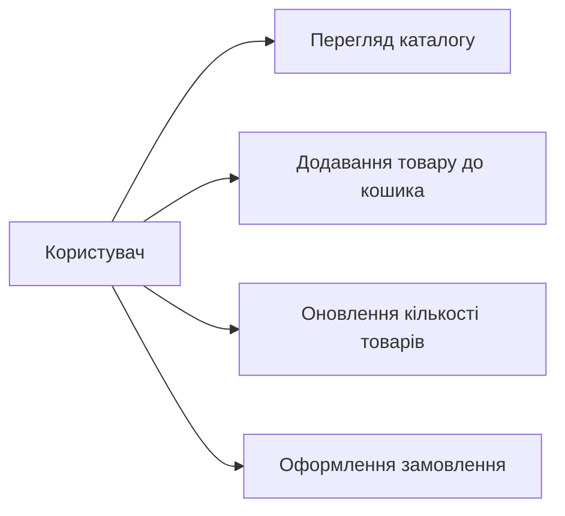
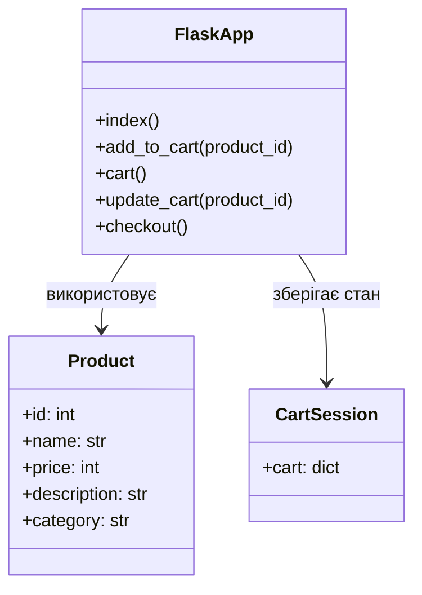

Діаграми

Діаграма варіантів використання

```mermaid
flowchart LR
    User["Користувач"] --> ViewCatalog["Перегляд каталогу"]
    User --> AddToCart["Додавання товару до кошика"]
    User --> UpdateCart["Оновлення кількості товарів"]
    User --> Checkout["Оформлення замовлення"]
```

Діаграма компонентів застосунку

```mermaid
classDiagram
    class FlaskApp {
        +index()
        +add_to_cart(product_id)
        +cart()
        +update_cart(product_id)
        +checkout()
    }

    class Product {
        +id: int
        +name: str
        +price: int
        +description: str
        +category: str
    }

    class CartSession {
        +cart: dict
    }

    FlaskApp --> Product : використовує
    FlaskApp --> CartSession : зберігає стан
```
